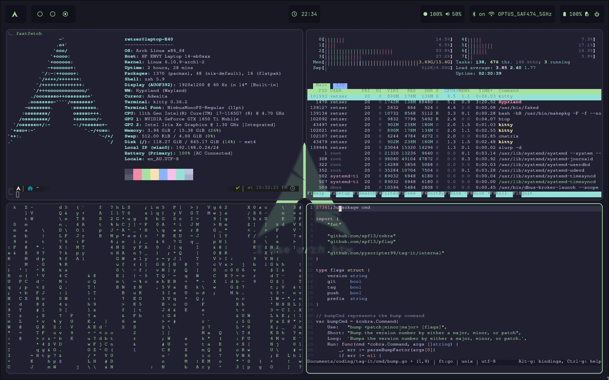

# Pyscripter99's Dotfiles



## Packages

| Program        | Name          |
|----------------|---------------|
| Color Scheme   | Catppuccin    |
| Window Manager | Hyprland      |
| Bar            | Waybar        |
| Text Editors   | vscode, micro |
| Shell          | zsh           |
| Terminal       | Kitty         |

## Installation

### Requirements

 * GNU Stow - `stow`
 * Kitty - `kitty`
 * Hyprland - `hyprland`
 * Waybar - `waybar`
 * Text Editor - `visual-studio-code-bin`, `micro`
 * ZSH - `zsh`

### Process

#### 1. Clone the repository
```sh
git clone https://github.com/pyscripter99/dotfiles.git
```

Clone the repository in your home directory.

#### 2. Remove old dotfiles

If you want to remove your old dotfiles, move them to a backup folder or simply remove them if you dont need them.

#### 3. Run GNU Stow

Now you have the dotfiles you can change the directory to dotfiles and run stow

```sh
cd dotfiles
stow .
```

Run this command everytime you add or remove a new file. Note changes to a file's contents automatically applies due to stow symlinking all files.

#### 4. Logout or Reboot and enjoy

The setup is now complete, if you have any suggestions feel free to make an issue.
